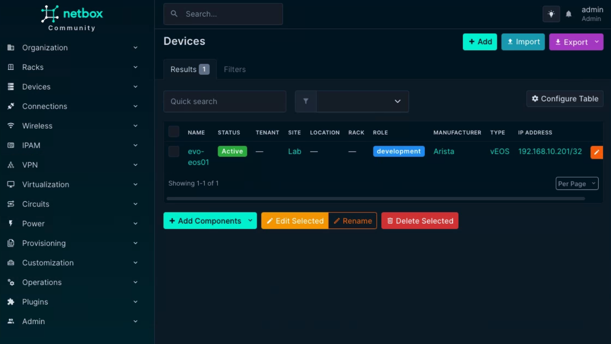
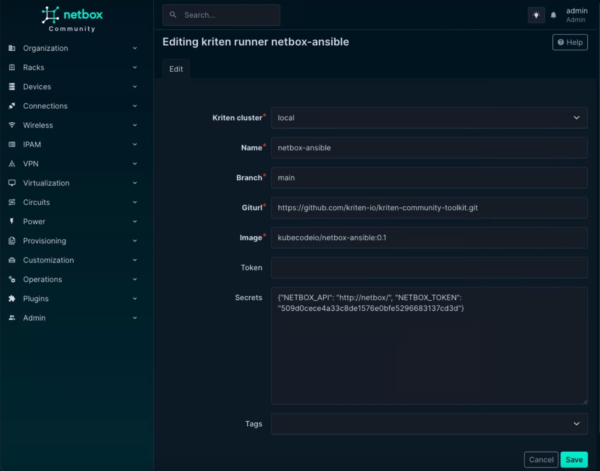
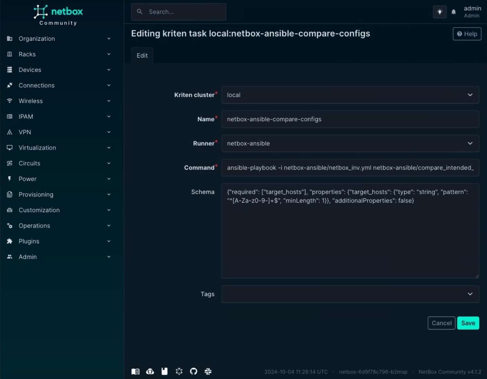
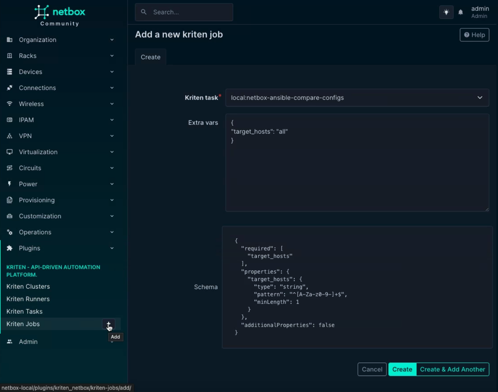

# netbox-ansible

Ansible playbooks that read the inventory from NetBox and connect to network devices.
These playbooks have been adapted from [netbox-learning](https://github.com/netboxlabs/netbox-learning) repository.

## Add devices to NetBox
This playbook uses NetBox as the inventory. Make sure the devices have the correct platform. [Ansible settings by platform](https://docs.ansible.com/ansible/latest/network/user_guide/platform_index.html#settings-by-platform)

## To run on Kriten:

### Create a runner which references an image with Ansible installed.
``` json
{
  "name": "netbox-ansible",
  "branch": "main",
   "gitURL": "https://github.com/kriten-io/kriten-community-toolkit.git"
  "image": "kubecodeio/netbox-ansible:0.1",
  "secret": {
      "NETBOX_TOKEN": <your-netbox-token>,
      "NETBOX_API": <your-netbox-url>
  },
}
```
### Create a task that references the runner and the command to run the script.
``` json
{
  "name": "netbox-ansible-compare-configs",
  "runner": "netbox-ansible",
  "command": "ansible-playbook -i netbox-ansible/netbox_inv.yml netbox-ansible/compare_intended_vs_actual.yml",
  "schema": {
          "properties": {
              "target_hosts": {
                  "type": "string",
                  "pattern": "^[A-Za-z0-9-]+$",
                  "minLength": 1
              }
              },
              "required": [
                  "target_hosts"
              ],
              "additionalProperties": false
          }
}
```
### Launch job.
``` json
{
  "target_hosts": "all"
}
```

## To run using NetBox Plugin
For installation details [Kriten NetBox Plugin](https://github.com/kriten-io/kriten-netbox-plugin)

### Check devices are in NetBox



### Add the runner



### Add the task



### Add the job




